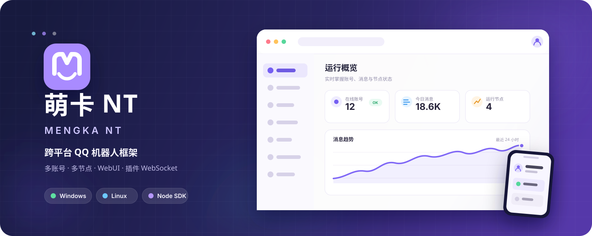

<div align="center">
  

  <p>
    <a href="https://github.com/CarlorOfficial/Mengka-NT/releases/latest"></a>
    
    
    
    
  </p>

  <p><strong>萌卡 NT</strong></p>
  <p>Mengka NT</p>
  <p>面向 QQ NT 协议的跨平台机器人框架</p>
  <p>多账号与多节点 · 可视化 WebUI · 插件 WebSocket · Windows / Linux</p>

  <p>
    <a href="https://github.com/CarlorOfficial/Mengka-NT/releases/latest">下载最新版</a>
    · <a href="https://github.com/CarlorOfficial/Mengka-NT/releases">版本记录</a>
    · <a href="https://github.com/CarlorOfficial/Mengka-NT/issues">问题反馈</a>
    · <a href="sdk/nodejs/README.md">插件 SDK</a>
  </p>
</div>

---

## 项目简介

萌卡 NT（Mengka NT）是一套面向 QQ NT 协议的机器人框架。它将账号、设备指纹、连接节点、插件服务和运行状态集中到 Web 管理界面，并通过插件 WebSocket 与 Node.js SDK 向外提供消息、联系人、群管理及扩展业务能力。

框架适用于 Windows 与 Linux，可同时管理多个 QQ 账号，并为每个账号保留独立的协议、设备、节点和登录状态。首次启动会在终端引导完成管理账号和监听地址初始化，之后主要操作都可以在浏览器中完成。

> 本仓库是萌卡 NT 的官方版本发布与插件 SDK 文档入口，不提供框架核心业务源码，也不包含运行配置、账号数据、数据库或密钥。

## 核心能力

| 模块 | 能力 |
| --- | --- |
| 账号管理 | 多 QQ 账号统一管理，支持密码登录、缓存登录、滑块与短信安全验证流程 |
| 协议与设备 | 独立选择 QQ 协议和设备指纹，集中维护设备环境信息 |
| 节点连接 | 多节点配置，支持按节点分配账号以及 HTTP / SOCKS5 代理 |
| 消息能力 | 群聊与私聊消息收发，支持图片、语音、视频、转发消息及消息撤回等常用操作 |
| 联系人与群 | 好友、群和群成员列表查询，入群申请与邀请处理，管理员、禁言和群签到等管理能力 |
| QQ 空间与任务 | 提供空间动态发布、点赞、浏览上报以及部分 QQ 服务任务的插件接口 |
| 插件系统 | 正向或反向 WebSocket 插件服务，按节点绑定机器人，提供 Node.js SDK 与统一 action 结果 |
| 可视化管理 | 概览、账号、指纹、节点、插件、容器、令牌、日志与消息面板 |

具体插件 API 以当前版本附带的 SDK 和服务端返回结果为准。

## v1.0.3 更新重点

- 同步上游最新前后端：修复 HTTP 等非安全上下文下 WebUI 复制失败；
- 新增空间文字动态发布及 QQ 等级任务查询/接收插件 API；
- 更新空间动态读取、点赞与取消点赞协议兼容性；
- 调整 MSF 错误回包分发，`-10202` 仅失败当前请求，不再让账号离线；启用 `-debug` 时打印 `cmd`、`errcode` 和 `errmsg`；
- 保留并验证好友列表分页、扩展字段及 QID 兼容修复；
- Node.js SDK 升级至 1.0.3，并补齐当前服务端提供的空间、QQ 任务和群扩展接口。

## 平台支持

| 平台 | 外发包 | 启动文件 | 架构 |
| --- | --- | --- | --- |
| Windows | `mengka-nt-v*-windows-amd64.zip` | `mengka-nt.exe` | AMD64 / x86_64 |
| Linux | `mengka-nt-v*-linux-amd64.tar.gz` | `mengka-nt` | AMD64 / x86_64 |
| Linux | `mengka-nt-v*-linux-arm64.tar.gz` | `mengka-nt` | ARM64 / AArch64 |

不同平台和架构的程序不能混用。请只从本仓库 [Releases](https://github.com/CarlorOfficial/Mengka-NT/releases) 下载正式外发包。

## 快速开始

### 1. 下载与解压

进入 [GitHub Releases](https://github.com/CarlorOfficial/Mengka-NT/releases/latest)，根据服务器系统和 CPU 架构下载对应压缩包，并完整解压到独立目录。

升级已有安装前，请先停止框架并备份程序目录中的 `data` 目录。不要用新包中的空目录覆盖已有运行数据。

### 2. 启动框架

<details open>
<summary><strong>Windows AMD64</strong></summary>

在解压目录运行：

```powershell
.\mengka-nt.exe
```

需要查看协议调试信息时使用：

```powershell
.\mengka-nt.exe -debug
```

</details>

<details>
<summary><strong>Linux AMD64 / ARM64</strong></summary>

在解压目录执行：

```bash
chmod +x ./mengka-nt
./mengka-nt
```

需要查看协议调试信息时使用：

```bash
./mengka-nt -debug
```

建议使用 systemd 或其他进程管理器保持框架运行，并在公网部署时通过 Nginx 配置 HTTPS 反向代理。

</details>

### 3. 首次初始化

第一次运行时，根据终端提示完成：

1. 设置 Web 服务监听地址和端口；
2. 创建后台管理员账号；
3. 等待终端显示服务端启动地址；
4. 使用浏览器访问该地址并登录管理后台。

将服务暴露到公网前，请配置 HTTPS、限制后台访问来源，并使用高强度管理员密码。

### 4. 添加并登录 QQ

进入 WebUI 后依次完成：

1. 在“节点”中检查或添加连接节点，需要时配置代理；
2. 在“指纹”中准备账号使用的设备指纹；
3. 在“账号”中添加 QQ，选择协议、设备指纹和所属节点；
4. 发起登录，根据返回状态完成滑块、短信或其他安全验证；
5. 登录成功后，在账号页查看在线状态、消息统计、会话和运行日志。

## WebUI

萌卡 NT 将常用管理能力集中到浏览器界面：

- **概览**：查看框架、系统资源、账号与消息运行状态；
- **账号**：添加、登录、离线和管理 QQ，查看等级、消息统计、会话与账号日志；
- **消息面板**：浏览群聊和私聊会话，并进行消息交互；
- **指纹**：创建和维护账号设备指纹；
- **节点**：维护连接节点、账号分配和代理配置；
- **插件**：创建插件服务、选择连接模式、绑定节点并管理令牌；
- **容器**：查看和管理框架使用的容器运行环境；
- **设置**：管理应用配置、访问令牌和版本信息。

## 插件 SDK

仓库提供 Node.js 插件 SDK，支持连接插件 WebSocket、接收机器人事件并调用框架 action。

### 安装

将 [`sdk/nodejs`](sdk/nodejs) 中的 `sdk.js`、`package.json` 和 `package-lock.json` 放入插件目录，然后执行：

```bash
npm install
```

### 连接示例

```js
import { createAPI } from './sdk.js'

const api = createAPI({
  host: '127.0.0.1',
  port: 3001,
  token: process.env.MENGKA_PLUGIN_TOKEN,
  name: 'example-plugin',
  version: '1.0.0',
  author: 'your-name',
})

await api.connect()

const framework = await api.get_framework_info()
console.log(framework.name, framework.version)
```

不要将插件令牌直接写入源码或提交到公开仓库。完整接入说明见 [Node.js SDK 文档](sdk/nodejs/README.md)，账号登录与安全验证流程见 [登录 API 文档](sdk/nodejs/login.md)。

## 安全与数据

- 外发包不包含用户账号、运行配置、数据库、日志或私钥；
- 管理后台、应用接口与插件服务使用各自的身份凭据，请分别保存；
- 插件只能访问自身绑定节点下的机器人，不能通过参数跨节点操作账号；
- `data` 目录包含框架运行数据，迁移或升级前必须单独备份；
- 调试日志可能包含命令和错误上下文，排查完成后不建议长期启用 `-debug`；
- 不要公开分享配置文件、数据库、插件令牌、Cookie 或登录缓存。

## 常见问题

<details>
<summary><strong>WebUI 无法打开</strong></summary>

先确认终端已经显示“服务端已启动”，再检查初始化时选择的监听地址和端口。远程服务器还需要放行防火墙或安全组端口；使用反向代理时，请同时检查 Host、WebSocket 和 HTTPS 配置。

</details>

<details>
<summary><strong>账号一直离线或登录失败</strong></summary>

确认账号选择了有效的协议、设备指纹和连接节点。根据账号日志中的错误码完成滑块、短信或其他安全验证；缓存失效时请改用密码登录重新生成缓存。

</details>

<details>
<summary><strong>插件连接不上框架</strong></summary>

检查插件服务的连接模式、监听地址、端口、令牌和节点绑定。插件与框架不在同一台机器时，还需要检查防火墙、安全组和反向代理是否允许 WebSocket 升级。

</details>

<details>
<summary><strong>升级后数据是否会丢失</strong></summary>

正常升级只替换程序与静态资源，不应删除原有 `data` 目录。升级前仍建议完整备份该目录，并确认新版本启动正常后再删除备份。

</details>

## 版本与反馈

- 最新版本：[GitHub Releases](https://github.com/CarlorOfficial/Mengka-NT/releases/latest)
- 历史版本：[版本记录](https://github.com/CarlorOfficial/Mengka-NT/releases)
- Bug 与建议：[提交 Issue](https://github.com/CarlorOfficial/Mengka-NT/issues)
- 插件开发：[Node.js SDK](sdk/nodejs/README.md)

本仓库当前不提供框架核心业务源码或开源许可。请仅从本仓库 Release 获取正式外发包。
